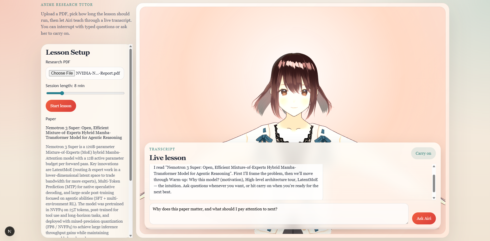

# Airi Paper Tutor



This is a focused MVP for the flow you described:

- upload an arXiv-style PDF
- generate an anime-style guided lesson from the paper
- show Airi's transcript on screen
- ask questions by typing
- tell her to carry on through the next lesson beat

## Stack

- Next.js App Router
- OpenAI Responses API for PDF-aware analysis
- OpenAI TTS for spoken playback
- Web Audio API loudness tracking for VRM mouth animation
- Three.js + `@pixiv/three-vrm` for the browser avatar

## Run

1. Install dependencies:

```bash
npm install
```

2. Add your API key:

```bash
copy .env.example .env.local
```

3. Start the app:

```bash
npm run dev
```

4. Open `http://localhost:3000`

5. Click `Start lesson` after choosing a PDF.

## Notes

- The backend uploads the PDF to OpenAI with `purpose: "user_data"` and asks `gpt-5` to plan and teach the lesson.
- The initial response creates the study plan only. Each `Carry on` generates the next spoken beat so the lesson length stays controllable.
- Spoken playback uses OpenAI TTS via `/api/tts`, with a feminine `shimmer` default voice and browser loudness analysis driving VRM mouth expressions in the canvas viewer.
- You can change the TTS voice with `OPENAI_TTS_VOICE` in `.env.local`.
- You can enable a branch-specific paywall by setting `NEXT_PUBLIC_ENABLE_PAYWALL=true` and providing `NEXT_PUBLIC_PAYWALL_CTA_URL` in Vercel for the `paywall` branch deployment.
- A bundled sample girl model is available at `public/vrm/AvatarSample_A.vrm` and loads by default.
- The avatar uses a small procedural idle pose in the browser: gentle sway, breathing, and arm settling on top of the neutral pose.
- This is an AIRI-style tutor shell, not the full `moeru-ai/airi` application.

## Improvement Plan

To move this MVP closer to a full tutor experience, the next iterations should focus on:

- [ ] Stability: harden upload and lesson generation flows, improve retry handling, surface clearer errors, add request timeouts, and cover key flows with integration tests.
- [ ] Expressiveness: expand avatar animation beyond mouth movement with gestures, head turns, emotion states, better timing between speech and motion, and more natural lesson pacing.
- [ ] Quizzes: generate checkpoint questions after each lesson segment, support multiple-choice and short-answer formats, grade responses, and adapt the next explanation based on mistakes.
- [ ] Images: extract or generate supporting visuals for paper concepts such as diagrams, figures, summaries, and step-by-step breakdowns that appear alongside the tutor.
- [ ] Videos: add short visual explainers for dynamic concepts, timeline-style lesson playback, and synchronized audio, captions, and scene changes for a more complete teaching flow.
- [ ] Full tutor features: introduce memory across sessions, progress tracking, lesson objectives, study recommendations, and a richer back-and-forth teaching loop that feels closer to a complete personal tutor.
